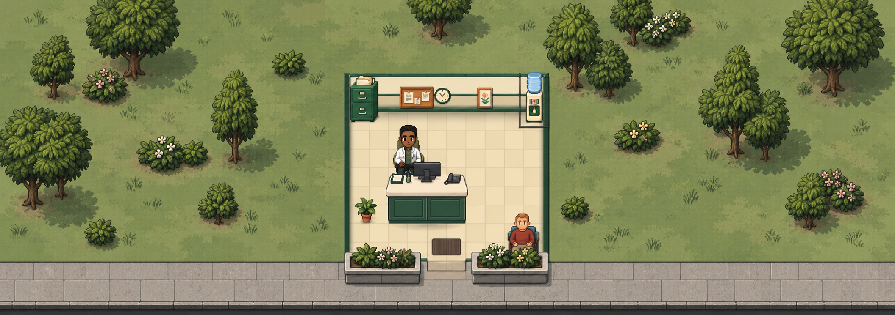
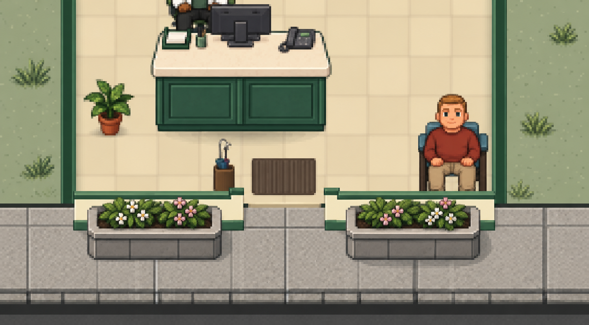

# Exterior frontage proposal

**2026-10-08 · Sol design-research worker · Proposal only · Owner decision pending**

Recommend **Option B: a planted clinic frontage**. Paint two purpose-built raised beds that fit the existing narrow sidewalk, organize the lawn planting into irregular groups, give the grass quiet broad variation, and replace the pavement's competing seams and heavy lower edge with one coherent paving-and-curb treatment. Keep the cream/deep-green room as the focal point and make its open entrance easy to locate.

Evidence: [current overview](exterior-frontage/current-qa-overview.png) and [front-door crop](exterior-frontage/current-qa-front-door-3x.png), supplied from a synthetic QA campaign at **110% in-game zoom**. The latter is an enlarged crop, not a separate game scale. Owner facts: **100% OS scaling; usually plays zoomed out**. The findings below distinguish screenshot observations from code-derived risks. No live campaign, browser storage, game code, or runtime artwork was changed.

## 1. Current state and causes

### Drawing inventory

| Element | How it is currently built; source locations | What the screenshots show |
| --- | --- | --- |
| Grass | **Procedural continuous surface**, not grass tiles: olive fill 0x9ba187, deterministic 1–2 px flecks and occasional tiny blades. [FacilityScene.ts:1451](../../apps/player/src/facility/FacilityScene.ts#L1451). The atlas grass swatch is deliberately unused because its baked dark edge produced a construction-grid appearance: [FacilityScene.ts:2452](../../apps/player/src/facility/FacilityScene.ts#L2452). | A large, nearly uniform gray-olive field. Flecks exist, but carry little readable information at this scale. No broad light/dark lawn masses, planting pockets, or gentle transitions organize the empty areas. Increasing tiny speckles alone would add noise. |
| Trees | **Transparent bitmap sprites** from four measured atlas frames: [bitmapAssetManifest.ts:225](../../apps/player/src/art/bitmapAssetManifest.ts#L225). A deterministic full-site candidate generator chooses frame, position and size: [exteriorLandscape.ts:82](../../apps/player/src/facility/exteriorLandscape.ts#L82). Rendering is in [FacilityScene.ts:2536](../../apps/player/src/facility/FacilityScene.ts#L2536); procedural shadeTree is the missing-atlas fallback. | The trees repeat a similar tall, pinched silhouette and comparable visual weight. Some crowns overlap, but the scene has little hierarchy between mature trees, understory and open lawn. The placement is actually hashed and irregular, rather than an evenly spaced grid; the uniform impression comes from the shared size/proportion language and similar foliage. |
| Shrubs and flowers in grass | **Separate bitmap sprites**, selected from three shrub and three flower frames, using the same hashed candidate field. [exteriorLandscape.ts:25](../../apps/player/src/facility/exteriorLandscape.ts#L25), [bitmapAssetManifest.ts:229](../../apps/player/src/art/bitmapAssetManifest.ts#L229). Each has intrinsic source contact/shadow pixels. | Many small isolated green and flower dots. These compete for attention without reading as garden beds or understory. Some larger shrubs have been narrowed into similar little round shapes. Sparse individual blooms disappear when zoomed out. |
| Sidewalk | **Tiled bitmap material plus procedural lines**. The 224×218 px source swatch already contains paving joints and a lower edge: [bitmapAssetManifest.ts:176](../../apps/player/src/art/bitmapAssetManifest.ts#L176). It is tiled at tileSize / 145: [FacilityScene.ts:2458](../../apps/player/src/facility/FacilityScene.ts#L2458). Additional top/bottom ink lines, joints every roughly 1.25 tiles, and a charcoal curb line are added in [FacilityScene.ts:4409](../../apps/player/src/facility/FacilityScene.ts#L4409). | Gray slabs have some texture, but the frontage reads as a long mechanical strip. The lower dark boundary is disproportionately strong, with a second edge just above it. The two joint systems have different rhythms; the finished material lacks a single clear paving structure. |
| Entrance planters | **One bitmap planter stretched into each bed, plus separate flower sprites**. Beds are 1.55 tiles wide × 0.5 high, bottom-anchored at sidewalk Y=0.5; positions and accents are declared in [frontDeskPresentation.ts:130](../../apps/player/src/facility/frontDeskPresentation.ts#L130). Draw/actor-depth handling: [FacilityScene.ts:4445](../../apps/player/src/facility/FacilityScene.ts#L4445). | Thin gray troughs, little visible soil, weak rim/front-face separation. The pink/white accents toward the front read as freestanding bushes over the bed faces and pavement. The beds do not feel proportionate to the otherwise richly painted building. |
| Front entrance | **Room shell/opening and procedural floor detail**, rather than a freestanding door sprite. The current south-wall renderer keeps the central opening and draws a warm threshold strip at ground depth, below people: [FacilityScene.ts:3354](../../apps/player/src/facility/FacilityScene.ts#L3354), [FacilityScene.ts:3363](../../apps/player/src/facility/FacilityScene.ts#L3363). The ribbed interior mat and umbrella stand are existing room touch-ups: [roomTouchups.ts:230](../../apps/player/src/facility/roomTouchups.ts#L230). | The narrow cream opening is legible in the enlarged crop but weak in the overview. The small warm strip and interior mat are disconnected from the outside paving. The thin beds do little to frame entry; there is no broad visual cue linking pavement to the opening. |
| Street transition | **Curb/world boundary only**. The layout has zero grass setback, one tile of sidewalk, a 0.12-tile curb band, and worldBottom equal to sidewalkBottom: [worldExteriorLayout.ts:1](../../apps/player/src/facility/worldExteriorLayout.ts#L1), [worldExteriorLayout.ts:55](../../apps/player/src/facility/worldExteriorLayout.ts#L55). | The dark lower strip can suggest a street edge, but there is no separate road surface in the inspected exterior renderer. A full road, crosswalk or driveway would expand this task's visual/world layout. |

### More consequential than adding detail

- **Planter distortion is substantial.** The source planter is 220×181 px (aspect 1.22), while its display box is 1.55×0.5 tiles (aspect 3.10). It is approximately **2.55 times wider relative to its height** than its source. Merely enlarging it uniformly would consume the walk lane. A new wide, low raised-bed painting must allocate more of its height to a visible stone face, rim and soil.
- **The front flowers are anchored outside the planted surface.** Several accent baselines are Y=0.57 while the bed ends at Y=0.50. All landscaping frames use a bottom-center anchor: [bitmapAssetManifest.ts:204](../../apps/player/src/art/bitmapAssetManifest.ts#L204). Therefore those bushes extend past the bed before depth ordering is considered. Existing planter tests prove entrance/lane clearance, not containment inside soil: [frontDeskPresentation.test.ts:81](../../apps/player/src/facility/frontDeskPresentation.test.ts#L81).
- **Different source trees receive the same tall display ratio.** The round tree's 321×345 px source has width/height 0.93; the generator's tree box is 1.32/2.12=0.62. That narrows it by about one third relative to its source. A single aspect-preserving scale per sprite will recover the crown/trunk relationships without repainting accepted trees.
- **Zoom-out exclusion may disagree with actual art bounds.** Rendering floors outdoor sizes at 22 px wide / 14 px high, while room/path exclusion uses the logical candidate width and height: [FacilityScene.ts:2538](../../apps/player/src/facility/FacilityScene.ts#L2538), [exteriorLandscape.ts:57](../../apps/player/src/facility/exteriorLandscape.ts#L57). At small tile sizes, the visible sprite can exceed the envelope that was checked. This is a code-derived risk, not a demonstrated defect in the supplied 110% screenshot. Validate it before promising clear paths at lower zoom.
- **Site props share one fixed depth**, rather than sorting with their individual contact Y: [FacilityScene.ts:2550](../../apps/player/src/facility/FacilityScene.ts#L2550). New grouped planting should order overlapping plants by contact within the landscape layer. Entrance beds already use the fixture baseline seam.
- The source atlases have painted contact pixels; the building also has a procedural ground shadow in [FacilityScene.ts:1487](../../apps/player/src/facility/FacilityScene.ts#L1487). Adding another generic dark ellipse to every object would double shadows. Tree white-gap cleanup is already deliberate and tree-only: [FacilityScene.ts:985](../../apps/player/src/facility/FacilityScene.ts#L985).

### Prior owner direction to preserve

| Direction | Evidence and consequence |
| --- | --- |
| Cream/deep-green palette, detailed furniture, coherent shadows; simplify excessive texture/decorative density toward the character style. | [GS-015_ROOM_DESIGN.md:138](../handoffs/GS-015_ROOM_DESIGN.md#L138), [GS-015_ROOM_DESIGN.md:164](../handoffs/GS-015_ROOM_DESIGN.md#L164). Preserve the approved room and its furnishings; ground materials should be quieter than people and equipment. |
| Building directly meets the **one-tile sidewalk**. Paired beds sit against the Front Desk in its rear pavement band; pedestrians retain a continuous front lane. | [front-desk-corrections-and-examination-redesign.md:30](../execplans/front-desk-corrections-and-examination-redesign.md#L30). Do not reintroduce a grass setback or a permanent green stripe. |
| Turf, paving, curb and planting belong to the world; whole plant envelopes disappear cleanly where construction or circulation occupies them. | [world-anchored-exterior-correction.md:9](../execplans/world-anchored-exterior-correction.md#L9), [exterior-landscaping-sidewalk-pass.md:13](../execplans/exterior-landscaping-sidewalk-pass.md#L13). Retain full-site, stable presentation planting and protect pan/zoom behavior. |
| The October 7 front-door correction moved the yellow threshold below walking people. | [CLAUDE_ANIMATION_COORDINATION.md:1374](../handoffs/CLAUDE_ANIMATION_COORDINATION.md#L1374). Preserve that layering fix. An older drawExterior comment says not to paint a threshold, but the actual current south-wall renderer does paint the floor strip; do not treat the comment as the complete current behavior. |
| Owner-approved zoom-out rendering uses LINEAR textures and high-quality canvas smoothing. | [CURRENT_THREAD_HANDOFF.md:424](../handoffs/CURRENT_THREAD_HANDOFF.md#L424), [FacilityScene.ts:900](../../apps/player/src/facility/FacilityScene.ts#L900). Paint stepped pixel clusters and crisp silhouettes, then test the actual filtering. Do not reverse the accepted renderer setting to satisfy older nearest-neighbor wording. |
| People enter from either side and walk the sidewalk offscreen; movement has recent accepted fixes. | [CURRENT_THREAD_HANDOFF.md:409](../handoffs/CURRENT_THREAD_HANDOFF.md#L409), [CLAUDE_ANIMATION_COORDINATION.md:780](../handoffs/CLAUDE_ANIMATION_COORDINATION.md#L780). Decorative changes must preserve the entire horizontal lane, entrance segment and offscreen continuation. |

The older visual-art-direction/exterior-pass documents describe a grass setback. The newer Front Desk correction and current world layout supersede that geometry. Their palette, world anchoring, layering and full-envelope culling guidance remain useful.

### Existing art and provenance

Both runtime atlases were visually inspected at source size. [environment/README.md:3](../../apps/player/public/art/environment/README.md#L3) records original AI-generated project artwork derived from approved references as art-direction input; it records the separate landscaping transparency cleanup at [line 16](../../apps/player/public/art/environment/README.md#L16).

| Runtime source | Native size | Verified SHA-256 |
| --- | --- | --- |
| [clinic-environment-atlas-v1.png](../../apps/player/public/art/environment/clinic-environment-atlas-v1.png) | 1254×1254 | FE663ED5A35AFCE37DA50CA69E7B51E1F19B4479006F7C751B1CCBF4C3309E7D |
| [clinic-landscaping-atlas-v1.png](../../apps/player/public/art/environment/clinic-landscaping-atlas-v1.png) | 1448×1086 | 0B208CE937A5B6E7C93AEE1E0061084F98C58DD10845ECF550892F2D020E6BCA |

The measured rectangles and anchors live in bitmapAssetManifest.ts. [replicate-photos-for-codex-art-direction.md:137](../execplans/replicate-photos-for-codex-art-direction.md#L137) records environment integration. Tools/doc searches located the room-touchup native workflow ([tools README:48](../../tools/room-design/touchup-2026-10/README.md#L48)) and its existing interior mat, but **did not locate a dedicated exterior painting builder or exact original prompts for these two atlases**. This is a provenance limitation, not evidence that none exists elsewhere. A new frontage pack should record its originals, exact prompts or painting workflow, anchors, export operations and hashes.

## 2. Options

| Option | Treatment of all five areas | Tradeoff |
| --- | --- | --- |
| **A. Repair the present composition** | Keep current lawn color with a few broad procedural variations; restore source tree ratios and reposition flowers into groups; keep large sidewalk slabs with one set of joints and a softer curb; paint a replacement low stone bed with integrated blooms; clarify the existing ground-level entrance seam and retain the interior mat. | Smallest art/code scope and familiar appearance. The lawn and paving remain fairly utilitarian; better anchoring alone will not give the frontage much identity. |
| **B. Planted clinic frontage — recommended** | Quiet textured lawn with broad tone patches and irregular planted pockets; varied trees with grouped understory; warm-gray staggered slabs and a restrained curb; substantial paired raised beds with visible soil, rim, front faces and contained white/pink plantings; a flush paving inset guides the eye to the open doorway and existing mat. | Strong improvement in depth and entrance recognition within the current geometry. Needs a small original ground/bed kit and careful low-zoom/culling QA. |
| **C. A small formal forecourt** | Same quiet lawn and varied grouped planting, but with more deliberate corner gardens; a wider paved entry path/apron, matching raised beds, stronger curb-to-street treatment and a cutaway-compatible small canopy/side sign. | Strongest architectural arrival cue. Requires a new frontage/camera/actor-presentation design if pavement is expanded, and a canopy can obscure people/interior. **Separate owner approval and a separate scoped task**; do not silently restore the old setback. |

### Recommended treatment

**Grass.** Keep the continuous procedural base, but introduce two or three restrained sage/olive tonal families in broad, irregular world-coordinate patches. Add sparse authored blade/clover clusters near planting, with calm ground in between. Scale variation should operate above the fleck level; avoid obvious tile squares, repeating tuft rows, bright checker patches and high-frequency grit. Where turf meets paving, use a thin tidy warm-gray stone edge with occasional small grass incursions on the grass side only. Around planting, use a subtle soil/leaf-litter contact transition rather than a pale halo.

**Trees and flowers.** Reuse the four existing tree silhouettes with their native aspect ratios. Mix mature trees, smaller trees and low understory in loose groups of two or three with unequal spacing; maintain a planted full site with open gaps, rather than clearing the landscape into a perimeter-only garden. Seed group anchors in site coordinates, independently of current rooms and simulation RNG. Preserve stable keys across redraw/reload; construction removes only plants whose complete visual bounds intersect it. Group white/pink flowers into a few readable masses beside shrubs, and allow occasional yellow accents farther from the entrance. Canopies may overlap other canopies with coherent contact ordering; crowns, soil skirts and shadows must stay clear of rooms, hallway floors, paving and the protected entrance corridor. Do not solve overlap by drawing plants underneath rooms and leaving fragments visible.

**Sidewalk and curb.** Keep the existing one-tile width/depth contract. Use pale warm-gray paving with broad rectangular slabs, two restrained shallow rows and a half-slab stagger. The material texture should contain **no baked joints**; one world-coordinate joint system owns the pattern. Use muted gray seams rather than ink outlines. Treat the final 0.12 tile as a light cap plus a softened shaded curb face, replacing the double dark border. Keep the curb visually distinct from the walk surface without adding a black empty strip or a new road. At the grass edge, preserve a clean readable boundary; at the street edge, the curb alone establishes the transition in this task.

**Raised beds.** Keep the paired 1.55-tile beds and their current west/east alignment. Paint a dedicated broad bed, not a squashed version of the current tall planter: thick pale rim, visible dark brown soil, a shaded warm-gray front face with two or three stone panels, low upright leaves and contained bloom groups. Reserve a readable rim and front face even when the plants are dense. Integrate plants into two finished bed variants so the front flowers cannot drift beyond the soil aperture. A complete bed is still an independent world prop, not a flattened scene. Fit all visible art and shadow in the rear half of the sidewalk; the lower half stays continuous. Keep bed contact depth behind passersby using the existing baseline seam.

**Entrance and wayfinding.** Retain the complete central opening and the brown ribbed mat inside it. Add a **flush**, one-tile-wide warm-stone inset on the existing exterior pavement; use a clear floor-material change with no vertical front face. Keep the current threshold's correct ground layer, harmonizing its color with the inset rather than recreating a yellow foreground bar. The paired beds, centered lighter inset and darker interior mat form the wayfinding cue at low zoom. A small wall-side entrance plaque can be considered later, but the recommended composition must work without reading miniature text. No canopy is needed for B; any later canopy needs a cutaway/occlusion proposal before art production.

### Scale and clarity rules

Design around the **actual rendered tile size T**, not the source PNG's resolution. At 24 px per tile, a 1.55-tile bed is about 37 px wide; a 512×160 source at uniform scale is about 12 px high. That leaves room for a several-pixel front face and a contrasting soil/rim mass. Individual petals are secondary.

The camera label below 100% is not a simple percentage multiplier of working tile size: [FacilityScene.ts:1313](../../apps/player/src/facility/FacilityScene.ts#L1313). Record T, in-game zoom, browser zoom and devicePixelRatio in QA. Check 110%, 100%, 70%, 50% and the 10% minimum at 100% OS scaling. These are proposed test points, not a claim about the owner's exact preferred zoom.

At closer zoom, reward inspection with stone panels, leaf clusters and soil. At ordinary zoom-out, preserve silhouettes, color/value masses, rim/face separation and the open entry. At the minimum zoom, spatial groups and the clear sidewalk matter; do not force tiny blooms to remain legible by holding whole sprites at a fixed screen size.

## 3. Concept renders

**All seven images are mockups only, generated with the built-in image generation tool. They are not approved game art, runtime assets, a replacement room, or proof of walking/collision geometry.**

### Compare options

Open the **A/B/C overviews** for the overall direction. For **B finishes**, compare images 05 and 06. For **B entry treatment**, compare 05 and 07: the same stone-bed baseline serves both comparisons. No finish or architectural choice has been approved.

| Option / choice | Image | One-line caption | Exact prompt |
| --- | --- | --- | --- |
| **A — repair the present composition** | [03 · A overview](exterior-frontage/concept-03-option-a-overview.png) | Quiet gray-olive lawn, simple aligned slabs and lower, plainer raised stone beds. | [Prompt](exterior-frontage/concept-03-option-a-overview-prompt.txt) |
| **B — recommended planted frontage** | [01 · B overview](exterior-frontage/concept-01-overview.png) | Grouped trees/understory, broader lawn variation and substantial paired raised beds. | [Prompt](exterior-frontage/concept-01-overview-prompt.txt) |
| **B — original entrance detail** | [02 · B detail](exterior-frontage/concept-02-entry-detail.png) | Original bed-construction mockup with visible rim, soil, stone faces and contained flowers. | [Prompt](exterior-frontage/concept-02-entry-detail-prompt.txt) |
| **B — warm-gray stone / with inset** | [05 · Stone + inset](exterior-frontage/concept-05-b-stone-with-inset.png) | Warm-gray stone beds and a flush warm-stone paving inset just outside the doorway. | [Prompt](exterior-frontage/concept-05-b-stone-with-inset-prompt.txt) |
| **B — trim-green paint / with inset** | [06 · Green + inset](exterior-frontage/concept-06-b-green-with-inset.png) | Both beds painted to match the building trim; retain the same flowers, geometry and inset. | [Prompt](exterior-frontage/concept-06-b-green-with-inset-prompt.txt) |
| **B — warm-gray stone / without inset** | [07 · Stone + plain paving](exterior-frontage/concept-07-b-stone-without-inset.png) | Ordinary gray sidewalk continues to the doorway; stone beds and indoor mat remain. | [Prompt](exterior-frontage/concept-07-b-stone-without-inset-prompt.txt) |
| **C — small formal forecourt** | [04 · C overview](exterior-frontage/concept-04-option-c-overview.png) | Corner gardens, a wider warm-stone entry apron, small green canopy and side ENTRY plaque. | [Prompt](exterior-frontage/concept-04-option-c-overview-prompt.txt) |

The overviews share the same nominal framing and elevated-front camera. The B finish/entry views share a single edit baseline, with small generated texture differences rather than guaranteed pixel registration. C's canopy projects over part of the cutaway interior in this mockup; choosing C would still require a separate geometry, occlusion and pedestrian-clearance review. All images are concept illustrations.

### B overview

[Open original 2112×745 render](exterior-frontage/concept-01-overview.png) · [Exact submitted prompt](exterior-frontage/concept-01-overview-prompt.txt)

The overall direction: broader tree silhouettes, quiet lawn variation, coherent planting groups and beds that register as raised stone objects. The room stays the visual center.

### Original B entrance detail

[Open original 1686×933 render](exterior-frontage/concept-02-entry-detail.png) · [Exact submitted prompt](exterior-frontage/concept-02-entry-detail-prompt.txt)

The bed construction target: rim, dark soil, contained flowering plants and a substantial front face. Compare with the detached blooms and flattened troughs in the supplied crop.

**Interpretation limits after visual review:** generation preserves the general camera/style but alters some interior pixels and enlarges the apparent beds/paving. The detail render retains more dark curb weight than recommended, and neither render fully realizes the proposed staggered joint rhythm. The overview's entry inset has an edge that could suggest a step; actual art must make it unambiguously flush. Tree shadows should be lighter and tuft repetition sparser than the overview if they compete with people. These images communicate material/composition, while the measured bed bounds, one-tile sidewalk, actor baseline and source aspect-ratio requirements below control implementation. Do not extract either scene as a game background.

[Generation/provenance manifest](exterior-frontage/concept-provenance.json) records output hashes, exact prompt files, generation originals and reference hashes. All concept images are retained at original output size without post-generation painting.

## 4. Bounded implementation plan for B

The manager owns direction, acceptance, scheduling and the eventual implementation ExecPlan. This worker has **not** dispatched implementation or edited that plan. Each milestone below should have its own explicit lane; shared FacilityScene/manifest work needs an ownership handoff.

### Proposed art kit

These are proposed painting/export targets, not claims about existing assets. Coordinates are native PNG pixels; anchors are measured floor contact for props and top-left for surfaces. Preserve aspect ratios with one uniform scale.

| Piece | Native size / anchor | Intended live size or placement |
| --- | --- | --- |
| Raised planted bed, west and east variants | **512×160**, bottom-center (256,160); transparent outside complete prop/shadow | Width **1.55T**, height **0.484T**, baseline **sidewalkTop+0.50T**. Full top is about +0.016T, so it stays outside the interior. Soil, flowers, rim and shadow fit inside that box. Front-face target roughly one third of image height; broad rim highlights, no detached accents. |
| Two broad lawn variation overlays | **256×128**, ground-center (128,64), transparent low-contrast edges | Irregular pockets roughly 3–6T wide; avoid tiling visible patch boundaries or using build-cell-sized squares. Continuous base remains procedural. |
| Three small grass-cluster silhouettes | **64×32**, contact (32,28), transparent | About 0.3–0.6T wide; sparse groups, no contrast strong enough to read as dropped objects. |
| Joint-free paving material | **128×128**, (0,0), opaque seamless material | Tile/crop under one procedural world-anchored slab system. Proposed slabs approximately 1.2T wide, two rows in the non-curb band, alternate row offset 0.6T. |
| Curb straight strip, two subtle variants | **256×16**, (0,0) | Uniform scale to **0.12T** high; repeat/crop horizontally. Light upper cap and muted shaded face; no separate thick black outline. |
| Flush entry inset/decal | **128×64**, (0,0) | **1T×0.5T**, ground layer immediately outside the existing opening. No raised edge or baked cross-path shadow. Preserve current interior mat. |
| Trees, shrubs, flowers | **Reuse existing measured source frames** and bottom-center anchors from the manifest | Tree widths approximately 1.2–1.7T with frame-derived heights; smaller companions and shrubs vary proportionally. Verify complete visual bounds including shadows. No new tree sheet is needed for the first pass. |

M1 should adjust the proposed source dimensions if painting proves a better exact fit, but must preserve the uniform-scale and rear-half-sidewalk contracts. Confirm the bed's face/rim survives actual reduced rendering before painting the rest of the kit.

### Milestones and acceptance

| Milestone | Owned lane / concrete work | Acceptance and evidence |
| --- | --- | --- |
| **M0 — direction and geometry signoff** | Manager coordination only: choose A/B/C, confirm warm stone/white-pink bed treatment, decide flush inset versus keeping the current threshold color. Record plan and lanes before source edits. | Approve a direction and measurable exterior bounds. Canopy, expanded pavement/road and new gameplay landscaping remain separate decisions. |
| **M1 — raised-bed pilot, then small art kit** | New original source/provenance folder such as tools/exterior-frontage-v1/ and versioned runtime PNGs under apps/player/public/art/environment/frontage-v2/. Start with one bed at the exact display size; reuse existing plants. | Original/source/export hashes; precise anchors and alpha bounds; reduced-size bed proof with rim, soil and face readable. Complete remaining kit only after pilot review. No repainting approved rooms or packing a whole scene screenshot. |
| **M2 — grass, pavement, curb and entry integration** | Exterior surface seams in FacilityScene.ts, bitmapAssetManifest.ts, environmentTilePhase.ts only where needed; a small pure frontage geometry helper/test if useful. | One paving joint authority; world-stable material phase; no fixed HUD layer; zero setback, one-tile sidewalk and existing 0.12 curb retained. Entry detail is below actors; no save, route, hit-target or camera changes. |
| **M3 — planting composition and planter containment** | exteriorLandscape.ts and tests, frontDeskPresentation.ts and tests, landscaping draw seams in FacilityScene.ts. | Grouped but full-site planting; stable keys; source aspect ratios retained; no 22/14-px minimum making sprites grow relative to rooms. Exclusion checks match actual rendered envelopes. All bed plants fit inside the soil opening. Sort overlapping site props by contact within their existing background layer. Preserve existing tree-gap cleanup and pedestrian/fixture depth. |
| **M4 — integrated synthetic QA and owner review** | Focused tests and a new tests/e2e/exterior-frontage.spec.ts; screenshot evidence. Manager runs browser/default-environment checks, reviews source/art deltas and owns acceptance. | Capture the matrix below. Existing approved room pixels/identity remain intact; both sidewalk directions and entrance transitions stay clear. No clinical data changes. Classify any unrelated concurrent test failures with evidence. |

Suggested focused unit command **after implementation**:

    npm.cmd run test --workspace @gamify-surgery/player -- --pool=threads src/facility/exteriorLandscape.test.ts src/facility/worldExteriorLayout.test.ts src/facility/exteriorActorPresentation.test.ts src/facility/frontDeskPresentation.test.ts src/facility/renderDepth.test.ts src/facility/environmentTilePhase.test.ts src/facility/doorPresentation.test.ts src/facility/roomTouchups.test.ts src/art/bitmapAssetManifest.test.ts src/art/treeGapCleanup.test.ts

Include the new frontage helper's tests when added. Then:

    npm.cmd run typecheck
    npm.cmd run build

For browser checks, first run a manager-controlled synthetic QA server at a confirmed unused port (5183 if available). In a task-specific PowerShell process, with that server already healthy:

    $env:GAMIFY_E2E_EXTERNAL_SERVER = '1'
    $env:GAMIFY_E2E_BASE_URL = 'http://127.0.0.1:5183'
    node ./node_modules/@playwright/test/cli.js test tests/e2e/exterior-frontage.spec.ts tests/e2e/floor-pattern-pan-stability.spec.ts tests/e2e/front-desk-visual.spec.ts tests/e2e/room-touchups.spec.ts --project=desktop-chrome --workers=1

The new spec does not exist yet. Repeat the new frontage spec with compact-desktop, laptop and phone projects as appropriate. Use isolated browser contexts/synthetic saves; record **location.origin**. Do not use the owner's campaign as a test fixture. This worker started no server and changed no opening pathway. Owner play remains **START_GAME.cmd → http://127.0.0.1:4173**, same persistent profile; QA ports/profiles and the remote Pages origin have separate storage.

### Visual and movement QA matrix

- At **100% OS scaling**, capture overview and doorway at 110/100/70/50/10% game zoom, browser zoom 100%; record actual tileSize and devicePixelRatio. Use the same crop/composition for before/after comparison. A reduced concept image alone is not acceptance of the live renderer.
- Verify bed rim/soil/front-face distinctions and central entry visibility at 70/50%, with no dependence on flower dots or miniature text. At 10%, beds and planting scale with the site and do not become oversized decorations.
- Pan horizontally and north; grass/paving patterns stay attached to the world, the sidewalk leaves the viewport naturally, and the return view restores the same planting.
- Build/undo a room and hallway through a planted cluster. Remove complete intersecting plant/shadow envelopes; unaffected plants retain keys/positions. Check at low zoom as well as 110%.
- Run ambient pedestrians, a patient, founder, employee and applicable service/companion arrivals from **both** sidewalk sides, through entry and back offscreen. Capture moving feet beside both beds and in the opening. People must pass in front of the beds without feet hidden by curb/threshold; no bed or flower artwork occupies the central aperture.
- Check Build Mode dimming, click targets/locators, mat and door layering, reload stability, mature expanded clinics and narrow viewports. Preserve the October 7 movement and smoothing fixes.

### Owner decisions

1. **Direction:** B is recommended. A is a smaller cleanup; C requires a separate architectural decision.
2. **Finish:** warm-gray stone, darker exposed soil and restrained white/pink blooms are recommended. A green-painted planter is an alternative if closer palette continuity is preferred.
3. **Entry:** approve a flush warm-stone pavement inset while retaining the existing interior mat and correct threshold layering; otherwise keep the current floor seam and use the raised beds alone as the cue.
4. **Canopy/sign:** defer for B. If requested, review a separate cutaway/actor-occlusion mockup before implementation.
5. **Density:** favor fewer isolated flower dots and stronger groups while preserving a planted full site. Inspect the actual game at the owner's usual zoom before final acceptance.

## Worker handoff and verification

Deliverables are this proposal, seven original-size mockups, seven exact prompt files, concept-provenance.json and [validation.json](exterior-frontage/validation.json), all under docs/design/exterior-frontage*. The owner-requested comparison pass added five concepts and the Compare options index while preserving the original two B images/prompts and supplied QA images. All text deliverables use UTF-8 without BOM. Source evidence is line-addressed; atlas provenance hashes match the repository README. The initial research receipt and the comparison-expansion checks are recorded separately in validation.json. Runtime tests were not run for documentation/concept-only work; the commands above are future implementation checks.

The initial research's scoped 116-file source/input snapshot detected concurrent changes in defaultCamera.ts and FacilityCanvas.tsx, plus newly added facilityCameraBounds.ts and its test. These files were not written, reset or accepted by this worker. At that research closeout, the other 114 snapshot files, including all cited drawing sources, both runtime atlases and both supplied screenshots, remained byte-exact. The later comparison pass took a fresh snapshot; its result is recorded under comparisonExpansion in validation.json. The proposal should be integrated around ongoing shared work; its acceptance belongs to the manager. No repository-wide Git cleanliness claim is made.

No Git commands, installs, game-code/art edits, browser/owner-storage access, external messages, commit, push, deployment or publication occurred. No subagents were spawned. The manager retains owner decisions, implementation authorization and the scoped GitHub-backup reminder; these proposal artifacts are **local only**. The shared handoff/ExecPlan was read but not edited because this brief explicitly restricts writes to docs/design/exterior-frontage*. Next action: manager reviews the actual files and presents the three direction/finish/entry decisions to the owner.
